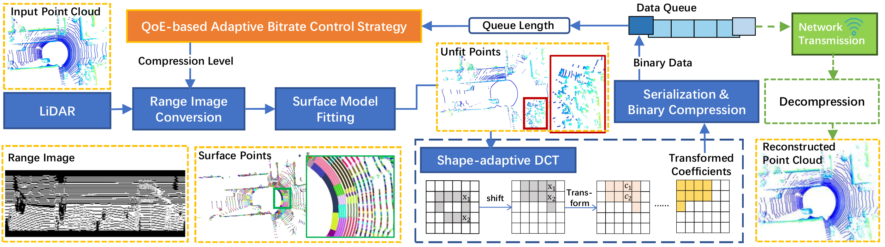

# RCPCC

## [ICRA 2025] Real-Time LiDAR Point Cloud Compression and Transmission for Resource-constrained Robots

Our paper is currently undergoing peer review. The code and application will be released once the paper is accepted.

### Introduction
We propose a real-time LiDAR point cloud compressionand transmission framework for resource-constrained robots,named RCPCC, which achieves a high compression rate,maintains high application-level accuracy, and operates at a speed (>10 Hz) that exceeds the LiDAR point cloud generation rate, enabling computationally constrained robots tooffload computation-intensive tasks to the cloud. To address bandwidth limitations and fluctuations during transmission,we propose a QoE-based adaptive bitrate control strategy thatadjusts the transmission quality based on the current and historical buffer queue lengths, ensuring optimal QoE and guaranteeing real-time and stable point cloud transmission.
